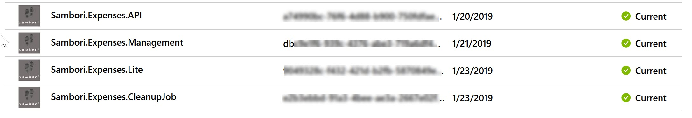
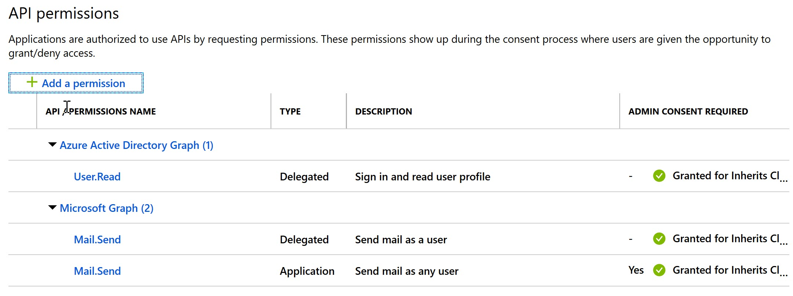
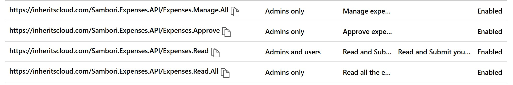

# netcoreconfbcn2019
Sample and materials used during my session in the .netcoreconf 2019 Barcelona

## Configuration
__Assuming you were in the session__

You need to register 4 Apps in your Azure AD:



### API App settings

* Create a Client Secret, as you need to call Graph API from this API
* Configure API permissions to send Email in Graph

* Configure the following scopes:

* Manually edit the Manifest and add the following Roles:
```json
"appRoles": [
		{
			"allowedMemberTypes": [
				"User",
				"Application"
			],
			"description": "Admins can perform all expenses actions.",
			"displayName": "Admin",
			"id": "81e10148-16a8-432a-b86d-ef620c3e48ef",
			"isEnabled": true,
			"lang": null,
			"origin": "Application",
			"value": "Admin"
		},
		{
			"allowedMemberTypes": [
				"User"
			],
			"description": "Approvers have the ability to approve expenses, and view and submit expenses",
			"displayName": "Approver",
			"id": "fc803414-3c61-4ebc-a5e5-cd1675c14bbb",
			"isEnabled": true,
			"lang": null,
			"origin": "Application",
			"value": "Approver"
		}
	]
```
* Change the Token version:
```json
	"accessTokenAcceptedVersion": 2,
```
* Update the setting "_knownClientApplications_" with the App Client IDs registered later
* Configure some users with the proper role using the "_Managed application in local directory_" option

Once this is configured, add the other 3 apps with the proper permissions to our API:
* Management: all scopes required
* Lite: Only Read scope required
* CleanupJob: Application permissions "Admin" role.
